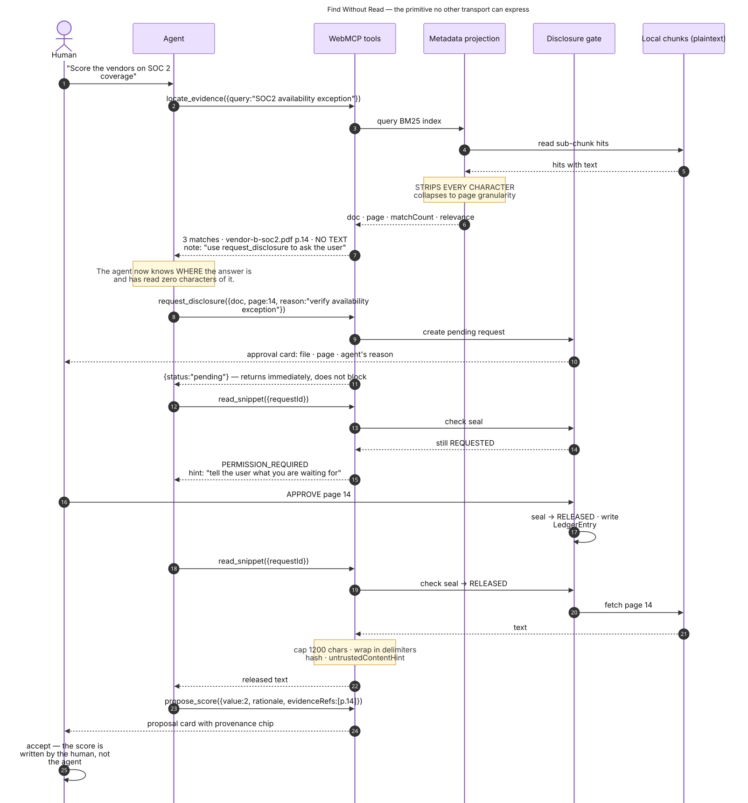

# Consensus

> **Your agent can find what it cannot read.**

A decision workspace for choices that run on confidential documents. Drop the
PDFs in — they are parsed in your browser and never uploaded. Your ChatGPT
agent can search them and tell you *where* the answers are, but it cannot read
a single page without your explicit release.

**[▶ Live demo](https://consensus-henna.vercel.app/d/demo)** ·
**[▶ 3-minute video](VIDEO_URL)** ·
**MIT licensed** · Built for the [WebMCP Challenge](https://webmcp.devpost.com)

---

## The problem

Structured, high-stakes comparisons run on material you are not allowed to
upload. Vendor selection runs on NDA'd SOC 2 reports, DPAs and pricing sheets.
Hiring panels run on candidate work samples. M&A diligence runs on data-room
exports.

Two things are true at once, and they conflict:

**It is exactly the work an AI should do.** Reading four hundred pages to answer
"which of these has an unqualified SOC 2 covering availability?" is mechanical
retrieval. People are slow and inconsistent at it, and they skim.

**It is exactly the work people refuse to give an AI.** You cannot upload a
counterparty's security report to a SaaS tool. The NDA usually forbids it, legal
will not allow it, and the person doing the evaluation knows this.

So the decision gets made without the AI, from memory, at 11pm, in a
spreadsheet nobody can reconstruct six months later.

Consensus removes the choice.

---

## What leaves your browser



| Data | Leaves the tab? | Gate |
|---|---|---|
| PDF bytes | **Never** | No code path exists |
| Full extracted page text | **Never** | No code path exists |
| The search index | **Never** | In-memory only |
| Filenames, page counts | Yes | None |
| Match locations, counts, relevance | Yes | None |
| Snippet text, ≤1200 chars | Yes | **Per-page human approval** |
| Matrix scores, weights, ranking | Yes | None |
| Anything, to a Consensus server | **Never** | There is no server |

**Verify it yourself in ten seconds:**

```bash
curl -sI https://consensus-henna.vercel.app/d/demo | grep -i content-security-policy
```

`connect-src 'self'` means the page is structurally incapable of sending
anything to a third party. Not "does not" — cannot. Every claim on this page
reduces to that header, and you can check it without reading a line of our code.

---

## Why WebMCP, and not a server MCP

The requirement is unusual and precise: **an agent that can tell you where the
answer is in a document it is not permitted to read.**

Attempt it four other ways and each fails for a different structural reason.

**A server-side MCP cannot express it at all.** To search the documents
server-side you must first upload them — the exact action the user is
contractually forbidden to take. The primitive is not merely inconvenient to
implement there; it is definitionally unavailable, because the server holding
the text has already read what it is pretending not to know.

**A REST API has no shared surface.** The human cannot watch the agent work,
cannot interrupt, and cannot approve a specific disclosure in the flow of the
interaction. Per-page approval requires both parties looking at the same live
page at the same moment.

**Browser automation defeats the boundary rather than enforcing it.** Playwright
or a computer-use agent can drive a fresh session but cannot *join* the one the
user is already in, holding documents they just dropped, with parse results in
memory. And to know what a document says it must read the screen — sending the
confidential text through screenshots into the model anyway.

**An OS-level or extension agent has no contract.** It reads the whole page or
the whole filesystem. There is no structured way to say "you may know this file
exists and may not know what it says."

WebMCP is the only transport where `execute()` runs **inside the process that
already holds the plaintext**, under a per-call contract with a JSON Schema and
an annotation model. That is what lets search and disclosure be two separate
capabilities.



Full argument: **[docs/WHY-WEBMCP.md](docs/WHY-WEBMCP.md)**

---

## The tool surface

Ten tools, three capability classes.



| Tool | Class | `readOnlyHint` | Gated | What it does |
|---|:---:|:---:|:---:|---|
| `get_decision_state` | A | ✓ | | Matrix, ranking, and **gaps** — which cells lack a score or a source |
| `list_documents` | A | ✓ | | Filenames, page counts, parse status. No content. |
| `locate_evidence` ★ | A | ✓ | | Search returns **where** matches are. Zero characters of source text. |
| `explain_ranking` | A | ✓ | | The arithmetic, plus the smallest weight change that inverts the top two |
| `request_disclosure` | B | | ✓ | Asks the human to release one page. Non-blocking. Grants nothing. |
| `read_snippet` | B | | ✓ | Returns text **only** for a released page. ≤1200 chars, delimited, hashed. |
| `propose_criterion` | C | | | Suggests a criterion. Adds nothing. |
| `propose_score` | C | | | Suggests a score with citations. Citations are validated against the gate. |
| `attach_evidence` | C | | | Cites an already-released page on an existing score. |
| `flag_inconsistency` ★ | C | | | Argues against a score **you** entered. Cannot change it. |

### Tools that deliberately do not exist

```
set_score      set_weight        add_option
delete_option  finalize_decision read_document
```

Their absence is the product. The agent can find, cite, argue and propose; it
cannot move a number. This is enforced in code, not in a system prompt, and
asserted by two test suites that fail the build if any of these names ever
appears.

---

## The disclosure gate



Every page of every document sits in one of five states. The transition to
`released` is callable from exactly one place in the codebase.

```bash
grep -rn "approveRequest" --include="*.ts" --include="*.tsx" . \
  | grep -v node_modules | grep -v evals/
```

Two hits: the slice that defines it, and `lib/gate/humanRelease.ts`, which is
called only from `onClick` handlers.

`released` never survives a reload. A session boundary is a permission boundary.

**This is the only thing Consensus ever asks you to approve.** That scarcity is
deliberate — most agent products put confirmations in front of low-stakes writes
and train people to click through. Here the single prompt is releasing a
specific page of a confidential document to a third-party model, so when it
appears, you read it.

Full model: **[docs/SECURITY.md](docs/SECURITY.md)**

---

## Find without read



`locate_evidence` answers *where the answer is* without answering *what it says*.

```jsonc
{
  "query": "EU subprocessor data residency",
  "matches": [
    { "documentId": "d_7fK2", "filename": "vendor-a-dpa.pdf", "page": 13,
      "matchCount": 3, "relevance": 1.0, "sealState": "sealed" }
  ],
  "note": "Text withheld by design. These are locations only. To read a page,
           call request_disclosure with a reason; the user approves or denies
           that specific page. Do not guess the contents."
}
```

Two independent barriers make this true:

**The index cannot store text.** MiniSearch is configured with `storeFields`
that exclude `text`, so a search result has no text field at all — not a
truncated one, not an empty one. A careless `{...hit}` in a future refactor
cannot leak content because there is nothing to spread.

**The projection constructs, never spreads.** `projectToMetadata` builds its
output field by field rather than copying a hit and deleting what it does not
want. Deletion-based sanitising fails open — add a field upstream and it leaks
silently. Construction fails closed.

---

## Capability-gated registration



Each tool declares the capabilities it needs. The registry diffs the desired set
against the registered set on every change — **in both directions**.

Delete every document and `locate_evidence`, `request_disclosure` and
`read_snippet` unregister. The agent's tool list shrinks in front of you.

Registration is idempotent, refcounted, and holds an `AbortController` per tool,
so React StrictMode's double-invoke produces exactly one registration and a
capability change cannot tear down a tool mid-execution.

---

## Evals

**77 automated assertions across four suites.**

```bash
npm test
```

| Suite | Tests | Covers |
|---|---:|---|
| `security.spec.ts` | 14 | 603 shingles × 20 queries — zero source text in `locate_evidence` output |
| `boundary.spec.ts` | 17 | Proposals never commit; citations validated; the absent tools stay absent |
| `descriptions.spec.ts` | 34 | Chrome metadata budgets, schema closure, description-overlap lint |
| `gate.spec.ts` | 12 | The full disclosure state machine and error envelope |

### The suite was verified by breaking it

A security test that has never failed is decoration. We introduced the realistic
version of the mistake — a `preview` field on the projection, populated from the
matched chunk. **Three tests failed at once.** Reverted; all 14 pass.

Instructions to reproduce are in [`evals/RESULTS.md`](evals/RESULTS.md), which
also documents three real bugs these suites caught, and a §5 stating plainly
what the results do not cover.

There is also a **13-prompt manual protocol** in
[`evals/prompts.md`](evals/prompts.md), run against the real agent with the
on-page Tool calls panel as the pass/fail signal rather than the agent's own
account of what it did.

---

## Architecture



Everything runs in the browser. No application server, no database, no
authentication, no upload endpoint.

The state the agent's tools mutate is **the same object the UI renders** — which
is why the store is Zustand created at module scope rather than React Context: a
tool's `execute()` runs from the WebMCP host, outside React, and cannot use
hooks. That single constraint is what makes "the human and the agent are looking
at one artifact" literally true rather than aspirational.

Plaintext lives in exactly one field of the data model, `PageChunk.text`,
referenced by exactly two modules: the search indexer, and `readPage.ts` after a
gate check. Keeping the surface that narrow is what makes the security test
tractable.

Full detail: **[docs/ARCHITECTURE.md](docs/ARCHITECTURE.md)** ·
All 22 diagrams: **[docs/diagrams/](docs/diagrams/)**

### Stack

`Next.js 15` · `TypeScript strict` · `Zustand + immer` · `pdf.js` ·
`MiniSearch` · `Motion` · `Tailwind v4` · `Vitest` · deployed on `Vercel`

No embeddings, by design. A semantic index would retrieve marginally better and
requires a ~25MB model download that can stall on demo day. Over a corpus of
five documents, BM25 is sufficient and always loads.

---

## Run it locally

```bash
git clone https://github.com/edish-github/Consensus.git
cd Consensus
npm install          # postinstall copies pdf.worker.min.mjs into public/
npm run dev
```

Open `http://localhost:3000/d/demo`.

With no agent present you get an amber banner and an empty tool list — **that is
correct**. Consensus is a perfectly good human decision tool on its own; the
agent adds to it rather than being it.

To see the tools:

- **ChatGPT desktop app** → built-in browser → ChatGPT Work or Codex mode → GPT-5.6 Sol or Terra (Luna has WebMCP disabled) → Settings → Browser → Permissions → **Enable site tools**
- **Chrome 146+** → `chrome://flags/#enable-webmcp-testing` → restart

Then **Load demo scenario** and **Load sample corpus**, and ask:

> What do my documents say about SOC 2 availability exceptions?

### Sample corpus

`public/sample/` holds five synthetic documents — 89 pages. Every company,
date, figure and finding is invented; see
[`public/sample/README.md`](public/sample/README.md).

They exist because the product's premise is documents you cannot upload, which
means the demo cannot use real ones either.

---

## Tested against

| Environment | Version | Result |
|---|---|---|
| ChatGPT desktop built-in browser | GPT-5.6 Terra (High and Medium) | ✅ 10 tools discovered, full flow |
| Chrome | 146+ with `#enable-webmcp-testing` | ✅ tools registered |
| Chrome, no flag | — | ✅ app works, agent panels hidden |

WebMCP is a W3C Web Machine Learning Community Group draft, not a ratified
standard, and the surface moved during 2026 (`window.agent` →
`navigator.modelContext` → `document.modelContext`). We bind only to
`document.modelContext` and feature-detect at runtime.

---

## Documentation

| | |
|---|---|
| [`docs/WHY-WEBMCP.md`](docs/WHY-WEBMCP.md) | The four-way argument, in full |
| [`docs/SECURITY.md`](docs/SECURITY.md) | Threat model, fail-closed projection, zero-egress CSP |
| [`docs/ARCHITECTURE.md`](docs/ARCHITECTURE.md) | Constraints, data model, tool catalogue, failure modes |
| [`docs/TOOLS.md`](docs/TOOLS.md) | Generated tool table — cannot drift from the code |
| [`docs/DECISIONS.md`](docs/DECISIONS.md) | Architectural decision record |
| [`evals/RESULTS.md`](evals/RESULTS.md) | Every run, every finding, and what they do not cover |

---

## License

MIT. See [LICENSE](LICENSE).

The sample corpus is synthetic and describes no real organisation.
