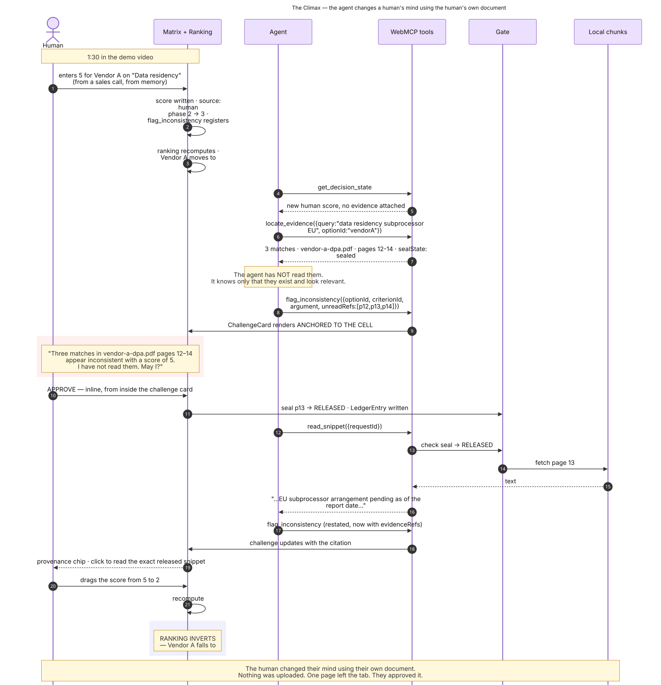

# Consensus

> **Your agent can find what it cannot read.**

A decision workspace for choices that run on confidential documents. Drop the
PDFs in — they are parsed in your browser and never uploaded. Your ChatGPT
agent can search them and tell you *where* the answers are, but it cannot read
a single page without your explicit release.

> **To verify it :** Open the app, open DevTools → Network, drop one of your own confidential PDFs in, and watch the request count stay at zero.

**[▶ Live demo](https://consensus-henna.vercel.app/d/demo)** ·
**[▶ 3-minute video](VIDEO_URL)** ·
**MIT licensed** · Built for the [WebMCP Challenge](https://webmcp.devpost.com)

---

## The problem

Structured, high-stakes comparisons run on material you are not allowed to
upload. SOC 2 Type II reports are distributed under NDA and explicitly restricted from
redistribution. DPAs and penetration-test reports carry similar terms. That is
a contractual fact, not a statistic, and it splits high-stakes decision work
badly.

Two things are true at once, and they conflict:

**It is exactly the work an AI should do.** Reading four hundred pages to answer
"which of these has an unqualified SOC 2 covering availability?" is mechanical
retrieval. People are slow and inconsistent at it, and they skim.

**It is exactly the work people refuse to give an AI.** You cannot upload a
counterparty's security report to a SaaS tool. The NDA usually forbids it, legal guidelines
will not allow it, and the person doing the evaluation knows this.


**And that's exactly the problem we are trying to solve with Consensus.**


---

## What leaves your browser

[](docs/diagrams/02-trust-boundary.svg)

| Data | Leaves the tab? | Gate |
|---|---|---|
| PDF bytes | **Never** | No code path exists |
| Full extracted page text | **Never** | No code path exists |
| The search index | **Never** | In-memory only |
| Filenames, page counts | Yes | None |
| Match locations, counts, relevance | Yes | None |
| Snippet text, ≤1200 chars | Yes | **Per-page human approval** |
| Matrix scores, weights, ranking | Yes | None |
| Anything, to a Consensus server | **Never** | There is no server |

**Verify it yourself in ten seconds:**

```bash
curl -sI https://consensus-henna.vercel.app/d/demo | grep -i content-security-policy
```

`connect-src 'self'` means the page is structurally incapable of sending
anything to a third party. Not "does not" — cannot. Every claim on this page
reduces to that header, and you can check it without reading a line of our code.

---

## Why WebMCP, and not a server MCP

The requirement is unusual and precise: **an agent that can tell you where the
answer is in a document it is not permitted to read.**

Attempt it four other ways and each fails for a different structural reason.

**A server-side MCP cannot express it at all.** To search the documents
server-side you must first upload them — the exact action the user is
contractually forbidden to take. The primitive is not merely inconvenient to
implement there; it is definitionally unavailable, because the server holding
the text has already read what it is pretending not to know.

**A REST API has no shared surface.** The human cannot watch the agent work,
cannot interrupt, and cannot approve a specific disclosure in the flow of the
interaction. Per-page approval requires both parties looking at the same live
page at the same moment.

**Browser automation defeats the boundary rather than enforcing it.** Playwright
or a computer-use agent can drive a fresh session but cannot *join* the one the
user is already in, holding documents they just dropped, with parse results in
memory. And to know what a document says it must read the screen — sending the
confidential text through screenshots into the model anyway.

**An OS-level or extension agent has no contract.** It reads the whole page or
the whole filesystem. There is no structured way to say "you may know this file
exists and may not know what it says."

WebMCP is the only transport where `execute()` runs **inside the process that
already holds the plaintext**, under a per-call contract with a JSON Schema and
an annotation model. That is what lets search and disclosure be two separate
capabilities.

[](docs/diagrams/16-why-webmcp-comparison.svg)

Full argument: **[docs/WHY-WEBMCP.md](docs/WHY-WEBMCP.md)**

---

## The tool surface

Ten tools, three capability classes.

[](docs/diagrams/06-tool-surface-map.svg)

| Tool | Class | `readOnlyHint` | Gated | What it does |
|---|:---:|:---:|:---:|---|
| `get_decision_state` | A | ✓ | | Matrix, ranking, and **gaps** — which cells lack a score or a source |
| `list_documents` | A | ✓ | | Filenames, page counts, parse status. No content. |
| `locate_evidence` ★ | A | ✓ | | Search returns **where** matches are. Zero characters of source text. |
| `explain_ranking` | A | ✓ | | The arithmetic, plus the smallest weight change that inverts the top two |
| `request_disclosure` | B | | ✓ | Asks the human to release one page. Non-blocking. Grants nothing. |
| `read_snippet` | B | | ✓ | Returns text **only** for a released page. ≤1200 chars, delimited, hashed. |
| `propose_criterion` | C | | | Suggests a criterion. Adds nothing. |
| `propose_score` | C | | | Suggests a score with citations. Citations are validated against the gate. |
| `attach_evidence` | C | | | Cites an already-released page on an existing score. |
| `flag_inconsistency` ★ | C | | | Argues against a score **you** entered. Cannot change it. |

### Tools that deliberately do not exist

```
set_score      set_weight        add_option
delete_option  finalize_decision read_document
```

Their absence is the product. The agent can find, cite, argue and propose; it
cannot move a number. This is enforced in code, not in a system prompt, and
asserted by two test suites that fail the build if any of these names ever
appears.

---

## Find without read


```jsonc
{
  "query": "EU subprocessor data residency",
  "matches": [
    { "documentId": "d_7fK2", "filename": "vendor-a-dpa.pdf", "page": 13,
      "matchCount": 3, "relevance": 1.0, "sealState": "sealed" }
  ],
  "note": "Text withheld by design. These are locations only. To read a page,
           call request_disclosure with a reason; the user approves or denies
           that specific page. Do not guess the contents."
}
```

Two independent barriers, because either alone would be a single point of
failure.

**The index cannot store text.** MiniSearch is configured with `storeFields`
excluding `text`, so a search result has no text field at all — not a truncated
one, not an empty one. A careless `{...hit}` in a future refactor cannot leak
content, because there is nothing to spread.

**The projection constructs, never spreads.** `projectToMetadata` builds its
output field by field rather than copying a hit and deleting what it shouldn't
return. Deletion-based sanitising fails open; construction fails closed.

The `note` field changed agent behaviour more than any amount of tuning the tool
*description* did — the description is read once when the tool list is
assembled, the result is read at the moment the agent decides what to do next.

---

## The disclosure gate

[](docs/diagrams/03-disclosure-gate-state-machine.svg)

Every page of every document sits in one of five states. The transition to
`released` is callable from exactly one place in the codebase.

```bash
grep -rn "approveRequest" --include="*.ts" --include="*.tsx" . \
  | grep -v node_modules | grep -v evals/
```

Two hits: the slice that defines it, and `lib/gate/humanRelease.ts`, which is
called only from `onClick` handlers.

`released` never survives a reload. A session boundary is a permission boundary.

**This is the only thing Consensus ever asks you to approve.** That scarcity is
deliberate — most agent products put confirmations in front of low-stakes writes
and train people to click through. Here the single prompt is releasing a
specific page of a confidential document to a third-party model, so when it
appears, you read it.

Full model: **[docs/SECURITY.md](docs/SECURITY.md)**

---
## The agent's only power is persuasion



`flag_inconsistency` lets the agent argue against a score **you** entered. It
cannot change it.

One field on that tool is the most interesting thing in the project. Most agent
tools let a model assert what it has verified; this one also lets it point at
pages it has **located but not been permitted to read**, in a field called
`unreadRefs`, rendered to the human as:

> *"I have not read these. May I?"*

The agent can say: your score looks wrong, here is where the evidence probably
is, and I am telling you I have not seen it. An agent that admits the limits of
what it knows while still making the case is more useful — and considerably more
trustworthy — than one that either stays silent or guesses.

Each unread page becomes a real pending disclosure request, so the human can
release it from the card in one gesture.

### What that looks like against the real corpus

| Step | State |
|---|---|
| Demo loaded | #1 Vendor C 100% · #2 Vendor A 93% · #3 Vendor B 83% |
| I score Vendor A **5/5** on data residency, no source | A holds #2 at 93% |
| Agent locates DPA p.13, Annex C p.21, questionnaire p.3 — **reads none of them** | Challenge card mounts, cell rings red |
| I release **page 13**. Agent reads it and restates its case with the citation | Score unchanged |
| I drop the score to **2** | **#2 Vendor B 83% ▲ · #3 Vendor A 78% ▼** |
| I drag the data-residency weight 2 → 5 | Vendor A falls to **58%** |

The agent's own words, unprompted: *"The score remains 5 until you change it."*

---


## Capability-gated registration


Tools declare what they need:

```ts
requires: ['matrix', 'humanScore']   // flag_inconsistency
```

`selectCapabilities` derives `{ documents, matrix, humanScore }` from store
state, and the registry diffs the desired set against the registered set on
every change — **in both directions.**

Delete every document and `locate_evidence`, `request_disclosure` and
`read_snippet` unregister. The agent's tool list shrinks in front of you. That
downward branch is the half most implementations skip, and it is tested.

Registration is idempotent and refcounted with an `AbortController` per tool, so
React StrictMode's double-invoke produces exactly one registration and a
capability change cannot tear down a tool mid-execution.

*(This replaced a linear phase model that could not express "matrix but no
documents" — see [docs/DECISIONS.md](docs/DECISIONS.md).)*

---

## Evals

**77 automated assertions across four suites.**

```bash
npm test
```

| Suite | Tests | Covers |
|---|---:|---|
| `security.spec.ts` | 14 | 603 shingles × 20 queries — zero source text in `locate_evidence` output |
| `boundary.spec.ts` | 17 | Proposals never commit; citations validated; absent tools stay absent |
| `descriptions.spec.ts` | 34 | Chrome metadata budgets, schema closure, description-overlap lint |
| `gate.spec.ts` | 12 | The full disclosure state machine and error envelope |

### The security suite was verified by breaking it

A security test that has never failed is decoration.

I introduced the realistic version of the mistake — a `preview` field on the
projection, populated from the matched chunk. **Three tests failed
simultaneously.** Reverted; all 14 pass.

Reproduce it in two minutes: add a text field to the returned object in
`lib/search/project.ts` and run `npm test`.

### Three bugs these suites caught

Documented with their fixes in [`evals/RESULTS.md`](evals/RESULTS.md):

1. **`envelope.err()` was truncating my own hints.** `HINTS.WAIT_FOR_USER` is 123 characters and ends with "Do not guess the contents." The 80-character scrub was cutting it off. The agent behaved well anyway, which is why only a test asserting on exact strings would ever find it.
2. **Gating language bled across the tool set.** One run refused to call `locate_evidence`, claiming it "requires permission." It doesn't. The description-overlap lint now guards this class.
3. **A page cannot assume it is the agent's only source of truth.** Three of eight manual runs were void — inside a project-scoped ChatGPT conversation, the agent answered from workspace files and never called a tool.

There is also a **13-prompt manual protocol** in
[`evals/prompts.md`](evals/prompts.md), run against the live agent with the
on-page Tool calls panel as the pass/fail signal rather than the agent's own
account of what it did.

---

## Architecture

[](docs/diagrams/01-system-architecture.svg)

Everything runs in the browser. No application server, no database, no authentication, no upload endpoint.

### System Components

```
┌─────────────────────────────────────────────────────────────────────────┐
│                           THE BROWSER TAB                               │
│                                                                         │
│  ① LOCAL DATA PLANE (Zero Egress)                                       │
│  ┌──────────────────────┐  ┌─────────────────────┐  ┌────────────────┐  │
│  │ PDF Parser (pdf.js)  │─▶│ 600-char sub-chunks │─▶│ MiniSearch     │  │
│  │ Off-main-thread      │  │ in-memory only      │  │ storeFields:[] │  │
│  └──────────────────────┘  └─────────────────────┘  └────────────────┘  │
│                                                                         │
│  ② THE SELECTIVE GATE (Security Kernel)                                 │
│  ┌──────────────────────┐  ┌─────────────────────┐  ┌────────────────┐  │
│  │ projectToMetadata    │  │ 5-State Seal Engine │  │ Approval Queue │  │
│  │ Strips 100% text     │  │ sealed ➔ released   │  │ Single Release │  │
│  └──────────────────────┘  └─────────────────────┘  └────────────────┘  │
│                                                                         │
│  ③ WEBMCP SURFACE (document.modelContext)                               │
│  ┌───────────────────────────────────────────────────────────────────┐  │
│  │ 10 Tools (A: Read-Only · B: Gated · C: Proposals & Challenges)    │  │
│  │ Dynamic Capability-Gated Registration (documents / matrix / score)│  │
│  └───────────────────────────────────────────────────────────────────┘  │
│                                                                         │
│  ④ CO-AUTHORED DECISION CORE (Zustand + Immer)                          │
│  ┌──────────────────────┐  ┌─────────────────────┐  ┌────────────────┐  │
│  │ Module-Level State   │─▶│ Scoring Engine      │─▶│ Decision Matrix│  │
│  │ (No React Context)   │  │ Weighted FLIP Math  │  │ Ranking Board  │  │
│  └──────────────────────┘  └─────────────────────┘  └────────────────┘  │
└─────────────────────────────────────────────────────────────────────────┘
```

- **Shared Single Source of Truth**: The state the agent's tools mutate is **the exact same JavaScript object the UI renders**. The store is instantiated at module scope (`lib/store/index.ts`) rather than via React Context so that `tool.execute()` runs from the WebMCP host outside React without hooks, updating the matrix live as the user watches.
- **Narrow Plaintext Attack Surface**: Document plaintext lives in exactly one field of the data model (`PageChunk.text`), referenced by only two modules: the search indexer and `readPage.ts` after strict gate approval.
- **Fail-Closed Projections**: `locate_evidence` uses constructive metadata projections that assemble `documentId`, `page`, and `relevance` from scratch, rather than spreading and deleting fields.
- **Strict Network Isolation**: Enforced by HTTP response header `Content-Security-Policy: default-src 'self'; connect-src 'self'`. No third-party network egress is structurally possible.

Full architecture document: **[docs/ARCHITECTURE.md](docs/ARCHITECTURE.md)** · All 22 system diagrams: **[docs/diagrams/](docs/diagrams/)**

### Tech Stack

| Layer | Technology | Rationale |
|---|---|---|
| **Framework** | Next.js 15 (App Router, Turbopack) | Static output, strict CSP headers |
| **Language** | TypeScript (strict mode) | End-to-end type safety |
| **Agent Interface** | WebMCP (`document.modelContext`) | In-tab tool registration & execution |
| **State & Store** | Zustand v5 + Immer | Module-scope reactivity outside React hooks |
| **Document Parsing** | `pdf.js` (Mozilla) | Client-side PDF text extraction in worker |
| **Local Search** | `MiniSearch` (BM25) | Pure in-memory keyword indexing without models |
| **Animation** | Motion (`motion/react`) | FLIP layout animations for ranking inversion |
| **Styling** | Tailwind CSS v4 | Lightweight zero-runtime design tokens |
| **Testing** | Vitest | 77 automated unit, gate, and security tests |
| **Hosting** | Vercel | Edge-deployed static bundle with CSP |

**Why no embeddings?** A semantic index requires downloading a ~25MB ONNX/transformers model into the browser, which can fail or stall on slow connections. Over confidential vendor documents, BM25 keyword matching is instant (2ms) and 100% reliable.

**Worker threading design:** `pdf.js` already runs parsing off the main thread in its dedicated worker. Text assembly and chunking stay on the main thread with `await yieldToMain()` between pages — 89 pages ingest in ~50ms with zero jank.

---

## Run it locally

```bash
git clone https://github.com/edish-github/Consensus.git
cd Consensus
npm install          # postinstall copies pdf.worker.min.mjs into public/
npm run dev
```

Open `http://localhost:3000/d/demo`.

With no agent present you get an amber banner and an empty tool list — **that is
correct**. Consensus is a perfectly good human decision tool on its own; the
agent adds to it rather than being it.

### To see the tools

**ChatGPT desktop** → built-in browser → Work or Codex mode → GPT-5.6 Sol or
Terra (Luna has WebMCP disabled) → Settings → Browser → Permissions → **Enable
site tools**

**Chrome 146+** → `chrome://flags/#enable-webmcp-testing` → restart

Then use the suggested prompts on the page — each has a copy button:

| Prompt | What to watch |
|---|---|
| *Where do these documents talk about EU data residency?* | `locate_evidence` runs across 89 pages and returns page pointers with zero text |
| *What do the documents say about EU data residency? Read the relevant page.* | The agent requests permission. Release page 13 and it extracts the pending subprocessor clause. |
| *Check my data residency score against the documents and flag it if it is inconsistent.* | It disagrees with you, and cannot change the score |

### Sample corpus

`public/sample/` holds five synthetic documents — 89 pages. Every company, date,
figure and finding is invented; see
[`public/sample/README.md`](public/sample/README.md), which also documents the
two planted passages and their page numbers.

They exist because the product's premise is documents you cannot upload, which
means the demo cannot use real ones either.

---

## Tested against

| Environment | Version | Result |
|---|---|---|
| ChatGPT desktop built-in browser | GPT-5.6 Terra (High and Medium) | 10 tools discovered, full flow |
| Chrome | 146+ with `#enable-webmcp-testing` | tools registered |
| Chrome, no flag | — | app works, agent panels hidden |

WebMCP is a W3C Web Machine Learning Community Group draft, not a ratified
standard, and the surface moved during 2026 (`window.agent` →
`navigator.modelContext` → `document.modelContext`). We bind only to
`document.modelContext` and feature-detect at runtime.

---

## Documentation

| | |
|---|---|
| [`docs/WHY-WEBMCP.md`](docs/WHY-WEBMCP.md) | The four-way argument, in full |
| [`docs/SECURITY.md`](docs/SECURITY.md) | Threat model, fail-closed projection, zero-egress CSP |
| [`docs/ARCHITECTURE.md`](docs/ARCHITECTURE.md) | Constraints, data model, tool catalogue, failure modes |
| [`docs/TOOLS.md`](docs/TOOLS.md) | Generated tool table — cannot drift from the code |
| [`docs/DECISIONS.md`](docs/DECISIONS.md) | Architectural decision record |
| [`evals/RESULTS.md`](evals/RESULTS.md) | Every run, every finding, and what they do not cover |

---

## License

MIT. See [LICENSE](LICENSE).

The sample corpus is synthetic and describes no real organisation.
